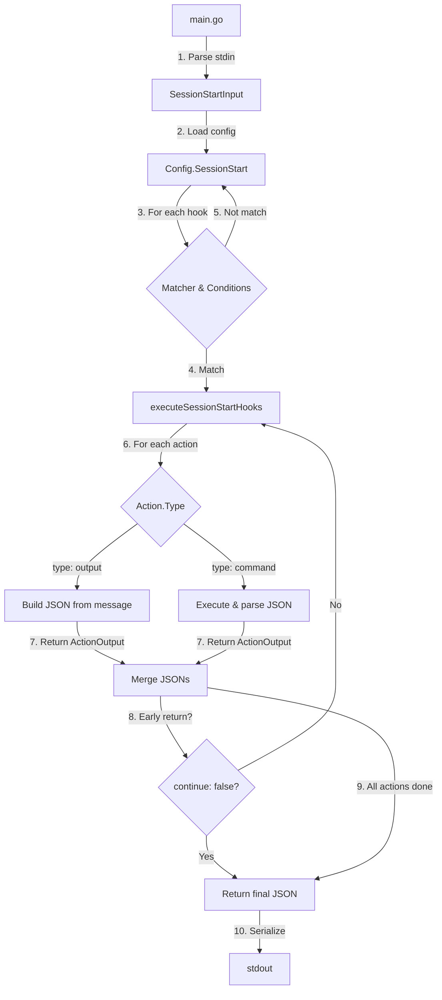

# Design: SessionStart Hook JSON出力対応

## Overview

cchookのSessionStartフックを、exit statusベースの出力からClaude Code公式のJSON出力形式に移行します。この実装はPhase 1として最もシンプルなSessionStartのみを対象とし、将来の全フック対応への基盤となります。

既存のexit status制御（0=成功、2=stderr出力でブロック）を、Claude Code仕様に準拠したJSON出力（`continue`, `hookSpecificOutput`, `systemMessage`）に置き換え、YAML設定のシンプルさを維持しながら強力なJSON制御を提供します。

## Steering Document Alignment

### Technical Standards (tech.md)

本設計は既存のcchookアーキテクチャパターンに従います:

- **モジュラー設計**: types.go（型定義）→ executor.go（アクション実行）→ hooks.go（フック実行）→ main.go（エントリーポイント）の明確な分離
- **テンプレート処理**: 既存の`unifiedTemplateReplace`を活用し、jqベースのテンプレートシステムとJSON出力生成を統合
- **エラーハンドリング**: カスタムエラー型（ExitError）を使わず、JSON出力に全ての状態を含める
- **テスト戦略**: 既存のユニットテスト構造（`*_test.go`）を拡張し、JSON出力検証を追加

### Project Structure (structure.md)

変更ファイル:
- `types.go`: SessionStartOutput構造体追加
- `executor.go`: ActionExecutor.ExecuteSessionStartAction変更（JSON出力返却）
- `hooks.go`: executeSessionStartHooks変更（JSON統合、ActionExecutor使用）
- `main.go`: JSON出力シリアライズ処理追加

## Code Reuse Analysis

### Existing Components to Leverage

- **Template Engine** (`template_jq.go`):
  - `unifiedTemplateReplace`: messageフィールドのテンプレート処理に利用
  - JSON出力生成前にテンプレート展開を実行

- **Command Execution** (`utils.go`):
  - 既存の`runCommand`: 他のフックイベント用に維持
  - 新規追加する`runCommandWithOutput`: stdout/stderrをキャプチャしてJSON出力パースに利用
  - CommandRunner interface: ActionExecutorでのテスト容易性のため既に実装済み

- **Configuration System** (`config.go`):
  - YAML読み込みは変更不要
  - Action構造体は既存のままで拡張可能

- **Condition Checking** (`utils.go`):
  - `checkSessionStartCondition`: 変更不要
  - 条件チェックロジックはJSON出力と独立

### Integration Points

- **Action Execution**: ActionExecutor.ExecuteSessionStartActionをJSON出力返却に変更（ActionExecutorパターン使用）
- **Hook Orchestration**: executeSessionStartHooksで複数アクションのJSON出力を統合（ActionExecutor経由でアクション実行）
- **Output Serialization**: main.goでJSON出力を標準出力にシリアライズ

## Architecture



### JSON出力構築フロー

1. **初期化**: `{"continue": true}` から開始（複数アクション時のデフォルト値）
2. **アクション実行**: 各アクションがActionOutputを返す
3. **JSON更新**: 以下のルールで最終JSON出力を更新
   - `continue`: 上書き（ただし`false`なら即座にearly return）
   - `hookSpecificOutput.hookEventName`: 一度設定されたら保持
   - `hookSpecificOutput.additionalContext`: `\n`で連結
   - `systemMessage`: `\n`で連結
4. **終了**: 全アクション完了後、またはearly returnで最終JSON出力を返す

## Components and Interfaces

### Component 1: SessionStartOutput (types.go)

**Purpose**: Claude Code仕様に準拠したSessionStart用JSON出力構造を定義

**Interfaces**:
```go
// SessionStart用のJSON出力構造（Claude Code共通フィールド含む）
type SessionStartOutput struct {
    Continue            bool                            `json:"continue"`
    StopReason          string                          `json:"stopReason,omitempty"`
    SuppressOutput      bool                            `json:"suppressOutput,omitempty"`
    SystemMessage       string                          `json:"systemMessage,omitempty"`
    HookSpecificOutput  *SessionStartHookSpecificOutput `json:"hookSpecificOutput,omitempty"`
}

// SessionStart固有のフィールド
type SessionStartHookSpecificOutput struct {
    HookEventName      string `json:"hookEventName"`      // 常に"SessionStart"
    AdditionalContext  string `json:"additionalContext,omitempty"`
}

// アクション実行結果（内部型）
type ActionOutput struct {
    Continue            bool
    StopReason          string
    SuppressOutput      bool
    SystemMessage       string
    HookEventName       string  // "SessionStart" or ""
    AdditionalContext   string
}
```

**Dependencies**: なし（標準ライブラリのencoding/jsonのみ）

**Reuses**: 既存のAction, SessionStartInput構造体

### Component 2: ActionExecutor.ExecuteSessionStartAction (executor.go)

**Purpose**: 単一アクション実行とActionOutput生成

**Interfaces**:
```go
func (e *ActionExecutor) ExecuteSessionStartAction(action Action, input *SessionStartInput, rawJSON interface{}) (*ActionOutput, error)
```

**入力**:
- `action`: 実行するアクション（type: output/command）
- `input`: SessionStart入力データ
- `rawJSON`: テンプレート処理用の生JSON

**出力**:
- `*ActionOutput`: JSON出力データ
- `error`: 実行エラー（nilなら成功）

**処理ロジック**:

**type: output の場合**:
1. messageをテンプレート処理（`unifiedTemplateReplace`）
2. messageが空文字列の場合: `continue: false` + systemMessage="Action output has no message"
3. messageが非空の場合:
   - `continue`の設定: action.Continue指定があればそれを使用、なければ`true`（デフォルト値）
   - `hookEventName`: "SessionStart"
   - `additionalContext`: 処理済みmessage
4. ActionOutputを返す

**type: command の場合**:
1. commandをテンプレート処理
2. コマンド実行（既存のrunCommand改修版）
   - 終了コード0以外: `continue: false` + systemMessage="Command failed with exit code X: <stderr>"
   - 標準出力が空: `continue: false` + systemMessage="Command produced no output"
3. 標準出力をJSONパース
   - パース失敗: `continue: false` + systemMessage="Command output is not valid JSON: <output>"
   - `hookEventName`がない: `continue: false` + systemMessage="Command output is missing required field: hookSpecificOutput.hookEventName"
   - `hookEventName`が"SessionStart"でない: 警告を標準エラー出力、フィールドは無視
   - `continue`がない: `false`をデフォルト値として設定
4. ActionOutputを返す

**Phase 1で未使用のフィールドについて**:
- `stopReason`と`suppressOutput`フィールドは、JSON Schema準拠のためActionOutput構造体に定義されているが、Phase 1では値を設定しない（ゼロ値のまま）
- type: outputの場合: これらのフィールドには何も設定しない
- type: commandの場合: 外部コマンドのJSON出力にこれらのフィールドがあっても無視する（パースしない）
- これらのフィールドはomitemptyなので、最終的なJSON出力には含まれない
- Phase 2以降（他のフックイベント対応時）に実装予定

**Dependencies**:
- `unifiedTemplateReplace` (template_jq.go)
- 新しい`runCommandWithOutput` (utils.go): stdout/stderrをキャプチャする版

**Reuses**: 既存のAction構造体、テンプレート処理ロジック

### Component 3: executeSessionStartHooks (hooks.go)

**Purpose**: 複数フック・複数アクションの実行とJSON出力統合

**Interfaces**:
```go
func executeSessionStartHooks(config *Config, input *SessionStartInput, rawJSON interface{}) (*SessionStartOutput, error)
```

**入力**:
- `config`: 設定ファイル（SessionStartフックリスト）
- `input`: SessionStart入力データ
- `rawJSON`: テンプレート処理用の生JSON

**出力**:
- `*SessionStartOutput`: 最終的なJSON出力
- `error`: 致命的なエラー（nilなら成功、エラー情報はJSON内のsystemMessageに含む）

**処理ロジック**:

1. **初期化**:
   ```go
   finalOutput := &SessionStartOutput{Continue: true}
   ```

2. **フックループ**: 各SessionStartHookについて
   - マッチャーチェック（input.Source）
   - 条件チェック（checkSessionStartCondition）
   - 条件エラー時: エラー収集、shouldExecute = false

3. **アクションループ**: マッチした各Actionについて
   - ActionExecutor経由でexecutor.ExecuteSessionStartActionを呼び出し（executor := NewActionExecutor(nil)で作成）
   - 戻り値のActionOutputでfinalOutputを更新:
     - `continue`: 上書き（ただし`false`の場合はループ終了）
     - `hookEventName`: 未設定 && ActionOutputに値がある → 設定、以降は保持
     - `additionalContext`: 非空なら`\n`で連結
     - `systemMessage`: 非空なら`\n`で連結
     - `stopReason`, `suppressOutput`: Phase 1では常にゼロ値（更新しない）
   - エラー発生時: エラー収集、ループ継続
   - `continue: false`が設定されたら即座にbreak（early return）

4. **エラー処理**:
   - 条件エラーまたはアクションエラーがある場合: `errors.Join`で結合してerror返却
   - ただし、finalOutputは構築済みの状態で返す（部分的な成功を反映）

5. **最終出力**: finalOutputを返す

**Dependencies**:
- `ActionExecutor.ExecuteSessionStartAction` (executor.go)
- `checkSessionStartCondition` (utils.go)

**Reuses**: 既存のマッチャー/条件チェックロジック

### Component 4: main.go JSON Serialization

**Purpose**: SessionStart用のJSON出力をstdoutに書き込む

**Interfaces**:
```go
// main()内のSessionStart処理
if *eventType == string(SessionStart) {
    // ... 既存のパース処理 ...

    output, err := executeSessionStartHooks(config, input, rawJSON)
    if err != nil {
        // エラーがあってもoutputは返されているので、JSON出力を優先
        // 致命的なエラーの場合はoutput自体にcontinue: false + systemMessageが設定されている
    }

    // JSON出力
    outputJSON, err := json.MarshalIndent(output, "", "  ")
    if err != nil {
        // シリアライズエラー: stdoutに出力できないので、従来のエラー処理
        fmt.Fprintf(os.Stderr, "Failed to serialize JSON output: %v\n", err)
        os.Exit(1)
    }

    fmt.Println(string(outputJSON))
    os.Exit(0)  // 常に0で終了（JSON内のcontinueフィールドで制御）
}
```

**Dependencies**: encoding/json

**Reuses**: 既存のSessionStart入力パース処理

## Data Models

### SessionStartOutput
```go
type SessionStartOutput struct {
    Continue            bool                            `json:"continue"`
    StopReason          string                          `json:"stopReason,omitempty"`
    SuppressOutput      bool                            `json:"suppressOutput,omitempty"`
    SystemMessage       string                          `json:"systemMessage,omitempty"`
    HookSpecificOutput  *SessionStartHookSpecificOutput `json:"hookSpecificOutput,omitempty"`
}
```

**フィールド説明**:
- `Continue`: Claude Codeに処理継続を指示（`false`でセッション起動をブロック）
- `StopReason`: `Continue: false`の時に表示されるメッセージ（Claude Code共通フィールド）
- `SuppressOutput`: 標準出力をトランスクリプトから隠すかどうか（Claude Code共通フィールド、デフォルト: false）
- `SystemMessage`: ユーザー向け警告メッセージ（Claudeには見えない、Claude Code共通フィールド）
- `HookSpecificOutput`: SessionStart固有のフィールド（hookEventName, additionalContext）

### SessionStartHookSpecificOutput
```go
type SessionStartHookSpecificOutput struct {
    HookEventName      string `json:"hookEventName"`
    AdditionalContext  string `json:"additionalContext,omitempty"`
}
```

**フィールド説明**:
- `HookEventName`: 常に"SessionStart"（Claude Code仕様で必須）
- `AdditionalContext`: Claudeに提供する追加コンテキスト（複数アクションで連結）

### ActionOutput（内部型）
```go
type ActionOutput struct {
    Continue            bool
    StopReason          string
    SuppressOutput      bool
    SystemMessage       string
    HookEventName       string  // "SessionStart" or ""
    AdditionalContext   string
}
```

**使用目的**: ActionExecutor.ExecuteSessionStartActionの戻り値として、JSON統合処理を簡素化

## Error Handling

### Error Scenarios

#### 1. 条件チェックエラー
- **シナリオ**: file_exists等の条件チェックでエラー発生
- **処理**:
  - エラーを収集（`conditionErrors`）
  - 該当フックをスキップ
  - 最終的に`errors.Join`で結合して返す
- **ユーザー影響**: エラーメッセージが標準エラー出力に表示、セッションは起動

#### 2. type: outputでmessageが空
- **シナリオ**: `type: output`だがmessageフィールドが空文字列または未設定
- **処理**:
  - `ActionOutput{Continue: false, SystemMessage: "Action output has no message"}`を返す
- **ユーザー影響**: systemMessageが表示、セッションは起動しない（設定エラー）

#### 3. type: commandでコマンド失敗
- **シナリオ**: コマンド終了コードが0以外
- **処理**:
  - `ActionOutput{Continue: false, SystemMessage: "Command failed with exit code X: <stderr>"}`を返す
- **ユーザー影響**: systemMessageにstderr内容が表示、セッションは起動しない

#### 4. type: commandでJSON出力が不正
- **シナリオ**: コマンド標準出力がJSONとしてパースできない
- **処理**:
  - `ActionOutput{Continue: false, SystemMessage: "Command output is not valid JSON: <output>"}`を返す
- **ユーザー影響**: systemMessageに出力内容が表示、セッションは起動しない

#### 5. type: commandでhookEventNameがない
- **シナリオ**: パースしたJSONに`hookSpecificOutput.hookEventName`がない
- **処理**:
  - `ActionOutput{Continue: false, SystemMessage: "Command output is missing required field: hookSpecificOutput.hookEventName"}`を返す
- **ユーザー影響**: systemMessageが表示、セッションは起動しない（外部コマンドの設定エラー）

#### 6. JSON出力のシリアライズ失敗
- **シナリオ**: `json.MarshalIndent`が失敗
- **処理**:
  - 標準エラー出力にエラーメッセージ
  - `os.Exit(1)`で終了
- **ユーザー影響**: プレーンテキストエラーが表示、セッションは起動しない

### エラーハンドリング原則

1. **グレースフルデグラデーション**: 可能な限りJSON出力を構築し、エラー情報を`systemMessage`に含める
2. **明確なエラーメッセージ**: ユーザーが問題を特定できるよう、具体的なエラー内容を含める
3. **safe side default**: エラー時は必ず`continue: false`を設定（セッション起動をブロック）

## Testing Strategy

### Unit Testing

#### types_test.go: JSON構造体テスト
- SessionStartOutput構造体のJSONシリアライズ/デシリアライズ
- omitemptyフィールドの動作確認
- hookEventName固定値の検証
- **JSONスキーマバリデーション**:
  - `testdata/schemas/session-start-output.json`に基づく自動検証
  - 必須フィールド（hookEventName）の存在確認
  - 型の正しさ（boolean, string等）の検証
  - 無効なJSON出力（hookEventName欠落、型不一致等）の検出

#### executor_test.go: アクション実行テスト
**ActionExecutor.ExecuteSessionStartActionのテストケース**:
1. `type: output`正常系:
   - messageあり、continue未指定 → continue: true
   - messageあり、continue: false指定 → continue: false
   - messageにテンプレート変数 → 展開される
2. `type: output`異常系:
   - messageが空 → continue: false + systemMessage
3. `type: command`正常系:
   - コマンド成功、有効なJSON → 正しくパース
   - JSON内にhookEventName="SessionStart" → 正しく設定
   - JSON内にcontinue未指定 → continue: false（デフォルト値）
4. `type: command`異常系:
   - コマンド失敗（終了コード非0） → continue: false + systemMessage
   - 標準出力が空 → continue: false + systemMessage
   - 標準出力が無効JSON → continue: false + systemMessage
   - hookEventNameがない → continue: false + systemMessage

#### hooks_test.go: フック実行テスト
**executeSessionStartHooksのテストケース**:
1. 単一アクション:
   - type: outputのみ → 正しいJSON出力
   - type: commandのみ → 正しいJSON出力
2. 複数アクション:
   - 両方成功 → additionalContext連結
   - 1つ目でcontinue: false → early return
   - 2つ目でcontinue: false → 1つ目の結果も反映
   - hookEventName保持 → 最初に設定された値を維持
3. 条件チェック:
   - 条件マッチ → アクション実行
   - 条件不一致 → スキップ
   - 条件エラー → エラー収集、フックスキップ

### Integration Testing

#### main_test.go: End-to-Endテスト
1. **実際の設定ファイルでのテスト**:
   - SessionStart: go.mod検出 → serena推奨メッセージ
   - SessionStart: .claude/tmp不存在 → 作成依頼メッセージ
2. **JSON出力検証**:
   - `continue`フィールドが常に存在
   - `hookEventName`が"SessionStart"
   - `additionalContext`に期待するメッセージ
3. **Exit code検証**:
   - 全ケースでexit code 0（JSON出力は常に成功）

### End-to-End Testing

#### 実環境テスト
1. **Claude Code統合テスト**:
   - cchookをClaude Codeのhookとして設定
   - セッション起動時にJSON出力が正しく処理される
   - `additionalContext`がClaude Codeに表示される
2. **エラーケーステスト**:
   - 設定エラー時にsystemMessageが表示される
   - コマンド失敗時にセッションがブロックされる

### テストカバレッジ目標

- **types.go**: SessionStartOutput関連 100%
- **executor.go**: ActionExecutor.ExecuteSessionStartAction 100%
- **hooks.go**: executeSessionStartHooks 100%
- **全体**: SessionStart関連の既存カバレッジを維持または改善

## Implementation Notes

### 移行パス

既存の`ExitError`ベース処理は完全に削除し、JSON出力ベースに置き換えます。理由:
1. SessionStartは情報表示が主用途で、exit statusの複雑な制御は不要
2. JSON出力への完全移行により、コードの一貫性が向上
3. 将来の全フック対応への明確な道筋

### パフォーマンス考慮事項

- **JSONシリアライズ**: `encoding/json`の標準実装を使用、SessionStartは軽量なので1ms未満
- **文字列連結**: `strings.Builder`を使用してメモリ効率を最適化
- **テンプレート処理**: 既存のjqクエリキャッシュを活用

### 後方互換性

利用ユーザーが少ないため、後方互換性は考慮せず、一気にJSON出力に移行します。
