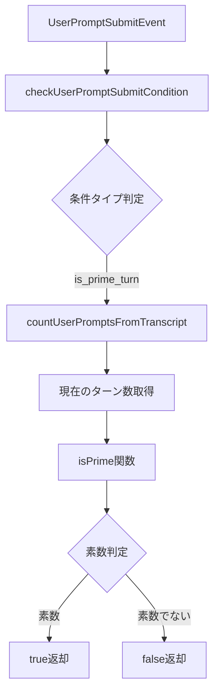

# 設計書

## 概要

素数判定conditionは、UserPromptSubmitイベント時にターン数（プロンプトカウント）が素数かどうかを判定する新しい条件タイプです。既存の`every_n_prompts`の実装を参考にし、同じtranscript解析基盤を再利用します。

## Steering Document との整合性

### 技術標準 (tech.md)
- **ConditionTypeの構造体パターン**: 
  - cchookでは`ConditionType`を`struct{v string}`として定義し、外部から直接値を作れないようにしています
  - これにより、定義済みの定数（`ConditionFileExists`など）のみが使用可能で、型安全性を保証します
  - 新しい`ConditionIsPrimeTurn`も同じパターンで定義します
- **Sentinel Error Pattern**: 条件評価で`ErrConditionNotHandled`を使用
- **エラーハンドリング**: `(bool, error)`リターンパターンを一貫して使用

### プロジェクト構造 (structure.md)
- **types.go**: 新しい`ConditionIsPrimeTurn`定数を追加
- **utils.go**: `isPrime()`関数と条件チェックロジックを追加
- **既存パターン**: 新しいConditionタイプ追加の確立されたパターンに従う

## コード再利用分析

### 既存コンポーネントの活用
- **countUserPromptsFromTranscript**: ターン数カウントのための既存関数を完全再利用
- **checkUserPromptSubmitCondition**: 既存の条件評価フローに統合
- **JSONストリーミングパーサー**: transcript解析の既存実装を活用

### 統合ポイント
- **条件評価システム**: `checkUserPromptSubmitCondition`関数内の新しいcaseとして追加
- **YAMLパーサー**: 既存の設定読み込みシステムと自動的に統合
- **テンプレートエンジン**: 既存のテンプレート処理と互換性維持

## アーキテクチャ



## コンポーネントとインターフェース

### isPrime関数
- **目的:** 整数が素数かどうかを判定
- **インターフェース:** `func isPrime(n int) bool`
- **依存関係:** なし（純粋関数）
- **アルゴリズム:** 試し割り法（√nまでの整数で割り切れるかチェック）

### 条件評価の拡張
- **目的:** `is_prime_turn`条件の評価ロジック
- **インターフェース:** 既存の`checkUserPromptSubmitCondition`内に統合
- **依存関係:** `countUserPromptsFromTranscript`, `isPrime`
- **再利用:** ターン数カウントロジックを完全に再利用

## データモデル

### 新しいConditionType定数
```go
// types.go
// ConditionTypeは文字列を内部に持つ構造体で、
// 外部から直接作成できないようにすることで型安全性を保証
var ConditionIsPrimeTurn = ConditionType{"is_prime_turn"}
```

### YAML設定フォーマット
```yaml
UserPromptSubmit:
  - matcher: ".*"
    conditions:
      - type: is_prime_turn
        value: "true"  # trueで素数ターン、falseで非素数ターン
    actions:
      - type: output
        message: "This is prime turn #{.turn_number}"
```

## エラーハンドリング

### エラーシナリオ
1. **Transcriptファイルが見つからない**
   - **処理:** `countUserPromptsFromTranscript`からのエラーをラップ
   - **ユーザー影響:** "failed to count prompts: [詳細]"エラーメッセージ

2. **無効なvalue値**
   - **処理:** "true"/"false"以外の値でエラー返却
   - **ユーザー影響:** "invalid value for is_prime_turn: expected true or false"

3. **Transcript解析エラー**
   - **処理:** 壊れたJSONエントリをスキップして継続
   - **ユーザー影響:** 正常にカウント可能な部分のみ使用

## テスト戦略

### ユニットテスト
- **isPrime関数のテスト**
  - 境界値: 1, 2, 3
  - 小さい素数: 5, 7, 11, 13
  - 合成数: 4, 6, 8, 9, 10
  - 大きい数: 97, 100, 1009

- **条件評価テスト**
  - value="true"で素数ターンがマッチ
  - value="false"で非素数ターンがマッチ
  - 無効なvalue値のエラーハンドリング

### 統合テスト
- **transcript解析との統合**
  - モックtranscriptファイルでのターン数カウント
  - 異なるセッションIDの分離
  - 壊れたJSONエントリの処理

### エンドツーエンドテスト
- **実際のフック実行**
  - 素数ターンでアクションが実行される
  - 非素数ターンでアクションがスキップされる
  - dry-runモードでの動作確認

## 実装の詳細

### 素数判定アルゴリズム
```go
func isPrime(n int) bool {
    if n <= 1 {
        return false
    }
    if n == 2 {
        return true
    }
    if n%2 == 0 {
        return false
    }
    for i := 3; i*i <= n; i += 2 {
        if n%i == 0 {
            return false
        }
    }
    return true
}
```

### パフォーマンス考慮
- 素数判定は最大10,000までを想定（√10,000 = 100なので高速）
- ターン数カウントは既存の効率的なストリーミング実装を使用
- 必要に応じて素数判定結果をキャッシュ可能（将来の最適化）