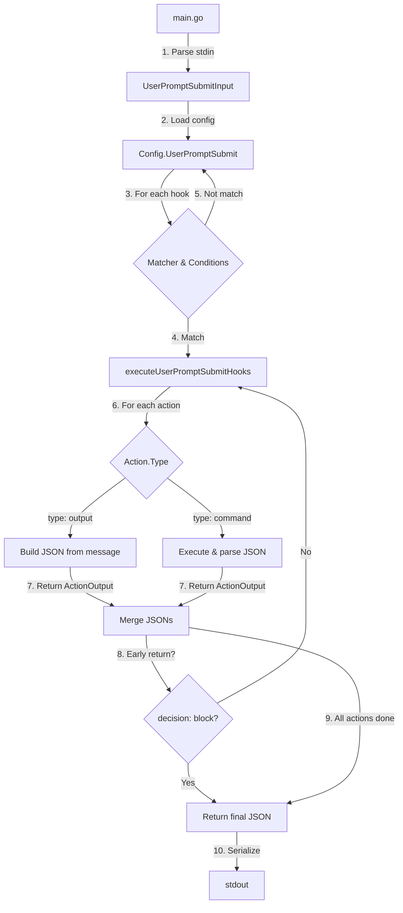

# Design: UserPromptSubmit Hook JSON出力対応

## Overview

cchookのUserPromptSubmitフックを、exit statusベースの出力からClaude Code公式のJSON出力形式に移行します。この実装はPhase 2として、Phase 1（SessionStart）で確立したパターンを踏襲しつつ、ブロック機能（`decision`フィールド）を追加します。

既存のexit status制御を、Claude Code仕様に準拠したJSON出力（`continue`, `decision`, `hookSpecificOutput`, `systemMessage`）に置き換え、YAML設定のシンプルさを維持しながら強力なJSON制御を提供します。

**Phase 2の特徴**:
- Phase 1のActionOutput構造体を拡張して再利用（Decisionフィールドを追加）
- テンプレート処理、コマンド実行、エラーハンドリングのロジックを再利用
- decision: "allow"（許可）/ "block"（ブロック）による制御
- decision: "block"でearly return（Phase 1のcontinue: falseと同様のパターン）

## Steering Document Alignment

### Technical Standards (tech.md)

本設計は既存のcchookアーキテクチャパターンに従います:

- **モジュラー設計**: types.go（型定義）→ executor.go（アクション実行）→ hooks.go（フック実行）→ main.go（エントリーポイント）の明確な分離（Phase 1と同様）
- **テンプレート処理**: 既存の`unifiedTemplateReplace`を活用（Phase 1と同様）
- **エラーハンドリング**: JSON出力に全ての状態を含める（Phase 1と同様）
- **テスト戦略**: 既存のユニットテスト構造（`*_test.go`）を拡張（Phase 1と同様）
- **依存性注入**: ActionExecutorパターンを継続使用（Phase 1と同様）

### Project Structure (structure.md)

変更ファイル:
- `types.go`: UserPromptSubmitOutput構造体追加、ActionOutput構造体にDecisionフィールド追加
- `executor.go`: ActionExecutor.ExecuteUserPromptSubmitAction追加（ExecuteSessionStartActionは維持）
- `hooks.go`: executeUserPromptSubmitHooks追加（executeSessionStartHooksは維持）
- `main.go`: UserPromptSubmit用のJSON出力シリアライズ処理追加

## Code Reuse Analysis

### Existing Components to Leverage

- **Template Engine** (`template_jq.go`):
  - `unifiedTemplateReplace`: Phase 1と同様にmessageフィールドのテンプレート処理に利用
  - JSON出力生成前にテンプレート展開を実行

- **Command Execution** (`utils.go`):
  - Phase 1で追加した`runCommandWithOutput`: stdout/stderrをキャプチャしてJSON出力パースに利用
  - CommandRunner interface: Phase 1と同様にActionExecutorでのテスト容易性を確保

- **Configuration System** (`config.go`):
  - YAML読み込みは変更不要
  - Action構造体にDecisionフィールドを追加（*string型、omitempty）

- **Condition Checking** (`utils.go`):
  - `checkUserPromptSubmitCondition`: 既存のまま使用
  - 条件チェックロジックはJSON出力と独立

- **Phase 1 Structures**:
  - `ActionOutput`構造体を拡張（Decisionフィールドを追加）
  - SessionStart用のロジック（ExecuteSessionStartAction、executeSessionStartHooks）は維持

### Integration Points

- **Action Execution**: ActionExecutor.ExecuteUserPromptSubmitActionを新規追加（ActionExecutorパターン使用）
- **Hook Orchestration**: executeUserPromptSubmitHooksで複数アクションのJSON出力を統合（Phase 1と同じパターン）
- **Output Serialization**: main.goでUserPromptSubmit用のJSON出力を標準出力にシリアライズ

## Architecture



### JSON出力構築フロー

1. **初期化**: `{"continue": true, "decision": "allow"}` から開始（複数アクション時のデフォルト値）
2. **アクション実行**: 各アクションがActionOutputを返す
3. **JSON更新**: 以下のルールで最終JSON出力を更新
   - `continue`: 常にtrue（UserPromptSubmitでは固定値）
   - `decision`: 上書き（ただし`"block"`なら即座にearly return）
   - `hookSpecificOutput.hookEventName`: 一度設定されたら保持
   - `hookSpecificOutput.additionalContext`: `\n`で連結
   - `systemMessage`: `\n`で連結
4. **終了**: 全アクション完了後、またはearly return（decision: "block"）で最終JSON出力を返す

## Components and Interfaces

### Component 1: UserPromptSubmitOutput (types.go)

**Purpose**: Claude Code仕様に準拠したUserPromptSubmit用JSON出力構造を定義

**Interfaces**:
```go
// UserPromptSubmit用のJSON出力構造（Claude Code共通フィールド含む）
type UserPromptSubmitOutput struct {
    Continue            bool                                  `json:"continue"`
    Decision            string                                `json:"decision"`              // "allow" or "block"
    StopReason          string                                `json:"stopReason,omitempty"`
    SuppressOutput      bool                                  `json:"suppressOutput,omitempty"`
    SystemMessage       string                                `json:"systemMessage,omitempty"`
    HookSpecificOutput  *UserPromptSubmitHookSpecificOutput   `json:"hookSpecificOutput,omitempty"`
}

// UserPromptSubmit固有のフィールド
type UserPromptSubmitHookSpecificOutput struct {
    HookEventName      string `json:"hookEventName"`      // 常に"UserPromptSubmit"
    AdditionalContext  string `json:"additionalContext,omitempty"`
}

// アクション実行結果（内部型、Phase 1から拡張）
type ActionOutput struct {
    Continue            bool
    Decision            string  // Phase 2で追加: "allow" or "block" or ""
    StopReason          string
    SuppressOutput      bool
    SystemMessage       string
    HookEventName       string  // "SessionStart" or "UserPromptSubmit" or ""
    AdditionalContext   string
}
```

**Dependencies**: なし（標準ライブラリのencoding/jsonのみ）

**Reuses**:
- Phase 1のActionOutput構造体を拡張（Decisionフィールド追加）
- 既存のAction, UserPromptSubmitInput構造体

**Phase 2で追加するフィールド**:
- `ActionOutput.Decision`: "allow", "block", または空文字列
- `Action.Decision`: YAML設定で`decision`を指定可能にする（*string型、omitempty）

### Component 2: ActionExecutor.ExecuteUserPromptSubmitAction (executor.go)

**Purpose**: 単一アクション実行とActionOutput生成（Phase 1のExecuteSessionStartActionと同様のパターン）

**Interfaces**:
```go
func (e *ActionExecutor) ExecuteUserPromptSubmitAction(action Action, input *UserPromptSubmitInput, rawJSON interface{}) (*ActionOutput, error)
```

**入力**:
- `action`: 実行するアクション（type: output/command）
- `input`: UserPromptSubmit入力データ
- `rawJSON`: テンプレート処理用の生JSON

**出力**:
- `*ActionOutput`: JSON出力データ（Decisionフィールドを含む）
- `error`: 実行エラー（nilなら成功）

**処理ロジック**:

**type: output の場合**:
1. messageをテンプレート処理（`unifiedTemplateReplace`）
2. messageが空文字列の場合: `decision: "block"` + systemMessage="Action output has no message"
3. messageが非空の場合:
   - `continue`: 常にtrue（UserPromptSubmitでは固定）
   - `decision`の設定: action.Decision指定があればそれを使用、なければ`"allow"`（デフォルト値）
   - decisionの値が"allow"または"block"以外の場合: `decision: "block"` + systemMessage="Invalid decision value: must be 'allow' or 'block'"
   - `hookEventName`: "UserPromptSubmit"
   - `additionalContext`: 処理済みmessage
4. ActionOutputを返す

**type: command の場合**:
1. commandをテンプレート処理
2. コマンド実行（Phase 1のrunCommandWithOutputを使用）
   - 終了コード0以外: `continue: true, decision: "block", hookEventName: "UserPromptSubmit"` + systemMessage="Command failed with exit code X: <stderr>"
   - 標準出力が空: `continue: true, decision: "allow", hookEventName: "UserPromptSubmit"`（検証型CLIツールの成功ケース。hookEventNameは必須フィールドとして常に設定）
3. 標準出力をJSONパース
   - パース失敗: `continue: true, decision: "block", hookEventName: "UserPromptSubmit"` + systemMessage="Command output is not valid JSON: <output>"
   - `hookEventName`がない: `continue: true, decision: "block", hookEventName: "UserPromptSubmit"` + systemMessage="Command output is missing required field: hookSpecificOutput.hookEventName"
   - `hookEventName`が"UserPromptSubmit"でない: `continue: true, decision: "block", hookEventName: "UserPromptSubmit"` + systemMessage="Invalid hookEventName: expected 'UserPromptSubmit', got '<value>'"（設定エラーとしてブロック）
   - `decision`がない: `"allow"`をデフォルト値として設定
   - `decision`の値が"allow"または"block"以外: `continue: true, decision: "block", hookEventName: "UserPromptSubmit"` + systemMessage="Invalid decision value: must be 'allow' or 'block'"（設定エラーとしてブロック）
4. ActionOutputを返す

**Phase 2で未使用のフィールドについて**:
- `stopReason`と`suppressOutput`フィールドは、JSON Schema準拠のためActionOutput構造体に定義されているが、Phase 2では値を設定しない（ゼロ値のまま）
- type: outputの場合: これらのフィールドには何も設定しない
- type: commandの場合: 外部コマンドのJSON出力にこれらのフィールドがあっても無視する（パースしない）
- これらのフィールドはomitemptyなので、最終的なJSON出力には含まれない
- Phase 3以降（PreToolUse等）で実装予定

**Dependencies**:
- `unifiedTemplateReplace` (template_jq.go) - Phase 1から継続
- `runCommandWithOutput` (utils.go) - Phase 1で追加済み

**Reuses**:
- Phase 1のテンプレート処理ロジック
- Phase 1のコマンド実行ロジック
- Phase 1のエラーハンドリングパターン

### Component 3: executeUserPromptSubmitHooks (hooks.go)

**Purpose**: 複数フック・複数アクションの実行とJSON出力統合（Phase 1のexecuteSessionStartHooksと同様のパターン）

**Interfaces**:
```go
func executeUserPromptSubmitHooks(config *Config, input *UserPromptSubmitInput, rawJSON interface{}) (*UserPromptSubmitOutput, error)
```

**入力**:
- `config`: 設定ファイル（UserPromptSubmitフックリスト）
- `input`: UserPromptSubmit入力データ
- `rawJSON`: テンプレート処理用の生JSON

**出力**:
- `*UserPromptSubmitOutput`: 最終的なJSON出力
- `error`: 致命的なエラー（nilなら成功、エラー情報はJSON内のsystemMessageに含む）

**処理ロジック**:

1. **初期化**:
   ```go
   finalOutput := &UserPromptSubmitOutput{Continue: true, Decision: "allow"}
   ```

2. **フックループ**: 各UserPromptSubmitHookについて
   - マッチャーチェック（既存ロジック）
   - 条件チェック（checkUserPromptSubmitCondition）
   - 条件エラー時: エラー収集、shouldExecute = false

3. **アクションループ**: マッチした各Actionについて
   - ActionExecutor経由でexecutor.ExecuteUserPromptSubmitActionを呼び出し（executor := NewActionExecutor(nil)で作成）
   - 戻り値のActionOutputでfinalOutputを更新:
     - `continue`: 常にtrue（UserPromptSubmitでは固定値、上書きしない）
     - `decision`: 上書き（ただし`"block"`の場合はループ終了）
     - `hookEventName`: 未設定 && ActionOutputに値がある → 設定、以降は保持
     - `additionalContext`: 非空なら`\n`で連結
     - `systemMessage`: 非空なら`\n`で連結
     - `stopReason`, `suppressOutput`: Phase 2では常にゼロ値（更新しない）
   - エラー発生時: エラー収集、ループ継続
   - `decision: "block"`が設定されたら即座にbreak（early return）

4. **エラー処理**:
   - 条件エラーまたはアクションエラーがある場合: `errors.Join`で結合してerror返却
   - ただし、finalOutputは構築済みの状態で返す（部分的な成功を反映）

5. **最終出力**: finalOutputを返す

**Dependencies**:
- `ActionExecutor.ExecuteUserPromptSubmitAction` (executor.go) - Phase 2で追加
- `checkUserPromptSubmitCondition` (utils.go) - 既存

**Reuses**:
- Phase 1のマッチャー/条件チェックロジック
- Phase 1のエラー収集パターン
- Phase 1のearly returnパターン（continue: false → decision: "block"）

### Component 4: main.go JSON Serialization

**Purpose**: UserPromptSubmit用のJSON出力をstdoutに書き込む（Phase 1と同様のパターン）

**Interfaces**:
```go
// main()内のUserPromptSubmit処理
if *eventType == string(UserPromptSubmit) {
    // ... 既存のパース処理 ...

    output, err := executeUserPromptSubmitHooks(config, input, rawJSON)
    if err != nil {
        // エラーがあってもoutputは返されているので、JSON出力を優先
        // 致命的なエラーの場合はoutput自体にdecision: "block" + systemMessageが設定されている
    }

    // JSON出力
    outputJSON, err := json.MarshalIndent(output, "", "  ")
    if err != nil {
        // シリアライズエラー: stdoutに出力できないので、従来のエラー処理
        fmt.Fprintf(os.Stderr, "Failed to serialize JSON output: %v\n", err)
        os.Exit(1)
    }

    fmt.Println(string(outputJSON))
    os.Exit(0)  // 常に0で終了（JSON内のdecisionフィールドで制御）
}
```

**Dependencies**: encoding/json

**Reuses**:
- Phase 1のJSON出力シリアライズパターン
- Phase 1のエラーハンドリングパターン
- Phase 1の終了コード制御（常に0）

## Data Models

### UserPromptSubmitOutput
```go
type UserPromptSubmitOutput struct {
    Continue            bool                                  `json:"continue"`
    Decision            string                                `json:"decision"`
    StopReason          string                                `json:"stopReason,omitempty"`
    SuppressOutput      bool                                  `json:"suppressOutput,omitempty"`
    SystemMessage       string                                `json:"systemMessage,omitempty"`
    HookSpecificOutput  *UserPromptSubmitHookSpecificOutput   `json:"hookSpecificOutput,omitempty"`
}
```

**フィールド説明**:
- `Continue`: 常にtrue（UserPromptSubmitでは固定値、後方互換性のため）
- `Decision`: "allow"（プロンプト送信を許可）または "block"（プロンプト送信をブロック）
- `StopReason`: `Decision: "block"`の時に表示されるメッセージ（Claude Code共通フィールド、Phase 2では未使用）
- `SuppressOutput`: 標準出力をトランスクリプトから隠すかどうか（Claude Code共通フィールド、Phase 2では未使用）
- `SystemMessage`: ユーザー向け警告メッセージ（Claudeには見えない、Claude Code共通フィールド）
- `HookSpecificOutput`: UserPromptSubmit固有のフィールド（hookEventName, additionalContext）

### UserPromptSubmitHookSpecificOutput
```go
type UserPromptSubmitHookSpecificOutput struct {
    HookEventName      string `json:"hookEventName"`
    AdditionalContext  string `json:"additionalContext,omitempty"`
}
```

**フィールド説明**:
- `HookEventName`: 常に"UserPromptSubmit"（Claude Code仕様で必須）
- `AdditionalContext`: Claudeに提供する追加コンテキスト（複数アクションで連結）

### ActionOutput（内部型、Phase 1から拡張）
```go
type ActionOutput struct {
    Continue            bool
    Decision            string  // Phase 2で追加
    StopReason          string
    SuppressOutput      bool
    SystemMessage       string
    HookEventName       string  // "SessionStart" or "UserPromptSubmit" or ""
    AdditionalContext   string
}
```

**使用目的**: ActionExecutor.ExecuteUserPromptSubmitActionの戻り値として、JSON統合処理を簡素化（Phase 1と同じパターン）

## Error Handling

### Error Scenarios

#### 1. 条件チェックエラー
- **シナリオ**: file_exists等の条件チェックでエラー発生
- **処理**:
  - エラーを収集（`conditionErrors`）
  - 該当フックをスキップ
  - 最終的に`errors.Join`で結合して返す
- **ユーザー影響**: エラーメッセージが標準エラー出力に表示、プロンプトは送信可能（decision: "allow"）

#### 2. type: outputでmessageが空
- **シナリオ**: `type: output`だがmessageフィールドが空文字列または未設定
- **処理**:
  - `ActionOutput{Continue: true, Decision: "block", HookEventName: "UserPromptSubmit", SystemMessage: "Action output has no message"}`を返す
- **ユーザー影響**: systemMessageが表示、プロンプト送信がブロックされる（設定エラー）

#### 3. type: commandでコマンド失敗
- **シナリオ**: コマンド終了コードが0以外
- **処理**:
  - `ActionOutput{Continue: true, Decision: "block", HookEventName: "UserPromptSubmit", SystemMessage: "Command failed with exit code X: <stderr>"}`を返す
- **ユーザー影響**: systemMessageにstderr内容が表示、プロンプト送信がブロックされる

#### 4. type: commandでJSON出力が不正
- **シナリオ**: コマンド標準出力がJSONとしてパースできない
- **処理**:
  - `ActionOutput{Continue: true, Decision: "block", HookEventName: "UserPromptSubmit", SystemMessage: "Command output is not valid JSON: <output>"}`を返す
- **ユーザー影響**: systemMessageに出力内容が表示、プロンプト送信がブロックされる

#### 5. type: commandでhookEventNameがない
- **シナリオ**: パースしたJSONに`hookSpecificOutput.hookEventName`がない
- **処理**:
  - `ActionOutput{Continue: true, Decision: "block", HookEventName: "UserPromptSubmit", SystemMessage: "Command output is missing required field: hookSpecificOutput.hookEventName"}`を返す
- **ユーザー影響**: systemMessageが表示、プロンプト送信がブロックされる（外部コマンドの設定エラー）

#### 6. decisionフィールドの値が不正
- **シナリオ**: `action.Decision`または外部コマンドのJSON出力の`decision`が"allow"/"block"以外
- **処理**:
  - `ActionOutput{Continue: true, Decision: "block", HookEventName: "UserPromptSubmit", SystemMessage: "Invalid decision value: must be 'allow' or 'block'"}`を返す（type: output/commandともに同様）
- **ユーザー影響**: 設定エラーとして扱われ、プロンプト送信がブロックされる

#### 7. type: commandでhookEventNameが不正
- **シナリオ**: パースしたJSONの`hookSpecificOutput.hookEventName`が"UserPromptSubmit"以外
- **処理**:
  - `ActionOutput{Continue: true, Decision: "block", HookEventName: "UserPromptSubmit", SystemMessage: "Invalid hookEventName: expected 'UserPromptSubmit', got '<value>'"}`を返す
- **ユーザー影響**: systemMessageが表示、プロンプト送信がブロックされる（外部コマンドの設定エラー）

#### 8. JSON出力のシリアライズ失敗
- **シナリオ**: `json.MarshalIndent`が失敗
- **処理**:
  - 標準エラー出力にエラーメッセージ
  - `os.Exit(1)`で終了
- **ユーザー影響**: プレーンテキストエラーが表示、プロンプト送信ができない

### エラーハンドリング原則

1. **グレースフルデグラデーション**: 可能な限りJSON出力を構築し、エラー情報を`systemMessage`に含める（Phase 1と同様）
2. **明確なエラーメッセージ**: ユーザーが問題を特定できるよう、具体的なエラー内容を含める（Phase 1と同様）
3. **safe side default**: エラー時は必ず`decision: "block"`を設定（プロンプト送信をブロック）

## Testing Strategy

### Unit Testing

#### types_test.go: JSON構造体テスト
- UserPromptSubmitOutput構造体のJSONシリアライズ/デシリアライズ
- omitemptyフィールドの動作確認
- hookEventName固定値の検証
- decisionフィールドの値検証（"allow"/"block"のみ）
- **JSONスキーマバリデーション**:
  - `testdata/schemas/user-prompt-submit-output.json`に基づく自動検証
  - 必須フィールド（hookEventName, decision）の存在確認
  - 型の正しさ（boolean, string等）の検証
  - 無効なJSON出力（hookEventName欠落、decision不正値等）の検出

#### executor_test.go: アクション実行テスト
**ActionExecutor.ExecuteUserPromptSubmitActionのテストケース**:
1. `type: output`正常系:
   - messageあり、decision未指定 → decision: "allow"
   - messageあり、decision: "block"指定 → decision: "block"
   - messageにテンプレート変数 → 展開される
2. `type: output`異常系:
   - messageが空 → decision: "block" + systemMessage
   - decision値が不正 → decision: "block" + systemMessage
3. `type: command`正常系:
   - コマンド成功、有効なJSON → 正しくパース
   - JSON内にhookEventName="UserPromptSubmit" → 正しく設定
   - JSON内にdecision未指定 → decision: "allow"（デフォルト値）
   - 標準出力が空 → decision: "allow"（検証型CLIツール）
4. `type: command`異常系:
   - コマンド失敗（終了コード非0） → decision: "block" + systemMessage
   - 標準出力が無効JSON → decision: "block" + systemMessage
   - hookEventNameがない → decision: "block" + systemMessage
   - decision値が不正 → 警告、decision: "allow"

#### hooks_test.go: フック実行テスト
**executeUserPromptSubmitHooksのテストケース**:
1. 単一アクション:
   - type: outputのみ → 正しいJSON出力
   - type: commandのみ → 正しいJSON出力
2. 複数アクション:
   - 両方成功 → additionalContext連結
   - 1つ目でdecision: "block" → early return
   - 2つ目でdecision: "block" → 1つ目の結果も反映
   - hookEventName保持 → 最初に設定された値を維持
   - continue常にtrue → 全ケースでtrue
3. 条件チェック:
   - 条件マッチ → アクション実行
   - 条件不一致 → スキップ
   - 条件エラー → エラー収集、フックスキップ

### Integration Testing

#### main_test.go: End-to-Endテスト
1. **実際の設定ファイルでのテスト**:
   - UserPromptSubmit: 特定パターンのプロンプト → ブロックメッセージ
   - UserPromptSubmit: 通常プロンプト → 許可メッセージ
2. **JSON出力検証**:
   - `continue`フィールドが常にtrue
   - `decision`フィールドが"allow"または"block"
   - `hookEventName`が"UserPromptSubmit"
   - `additionalContext`に期待するメッセージ
3. **Exit code検証**:
   - 全ケースでexit code 0（JSON出力は常に成功）

### End-to-End Testing

#### 実環境テスト
1. **Claude Code統合テスト**:
   - cchookをClaude Codeのhookとして設定
   - プロンプト送信時にJSON出力が正しく処理される
   - `additionalContext`がClaude Codeに表示される
   - `decision: "block"`でプロンプト送信がブロックされる
2. **エラーケーステスト**:
   - 設定エラー時にsystemMessageが表示される
   - コマンド失敗時にプロンプト送信がブロックされる

### テストカバレッジ目標

- **types.go**: UserPromptSubmitOutput関連 100%
- **executor.go**: ActionExecutor.ExecuteUserPromptSubmitAction 100%
- **hooks.go**: executeUserPromptSubmitHooks 100%
- **全体**: UserPromptSubmit関連の既存カバレッジを維持または改善

## Implementation Notes

### Phase 1からの再利用

Phase 1で確立したパターンを最大限再利用します：

1. **ActionOutput構造体の拡張**:
   - Decisionフィールドを追加
   - SessionStart、UserPromptSubmit共通で使用
   - 将来のフックイベント（PreToolUse等）にも対応可能

2. **ExecuteXXXActionメソッドパターン**:
   - Phase 1のExecuteSessionStartActionをそのまま維持
   - 同じシグネチャでExecuteUserPromptSubmitActionを追加
   - テンプレート処理、コマンド実行、エラーハンドリングのロジックを共有

3. **executeXXXHooksパターン**:
   - Phase 1のexecuteSessionStartHooksをそのまま維持
   - 同じ構造でexecuteUserPromptSubmitHooksを追加
   - マッチャー、条件チェック、エラー収集のロジックを共有

4. **Early Returnパターン**:
   - Phase 1: `continue: false`でループ終了
   - Phase 2: `decision: "block"`でループ終了
   - 同じパターン、異なるフィールド名

### パフォーマンス考慮事項

- **JSONシリアライズ**: Phase 1と同様、1ms未満
- **文字列連結**: Phase 1と同様、`strings.Builder`を使用してメモリ効率を最適化
- **テンプレート処理**: Phase 1のjqクエリキャッシュを活用

### 後方互換性

SessionStartのJSON出力対応（Phase 1）は維持され、UserPromptSubmitの追加による影響はありません。

### Phase 3への道筋

Phase 2完了後、Phase 3（PreToolUse）では以下を実装予定：
- `permissionDecision`フィールド（"allow", "deny", "ask"）
- `updatedInput`機能（ツール入力の動的変更）
- ActionOutput構造体をさらに拡張して対応
